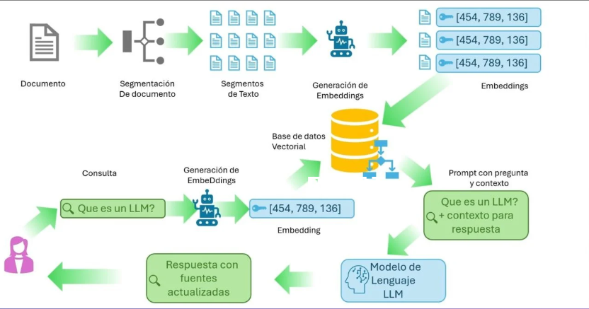
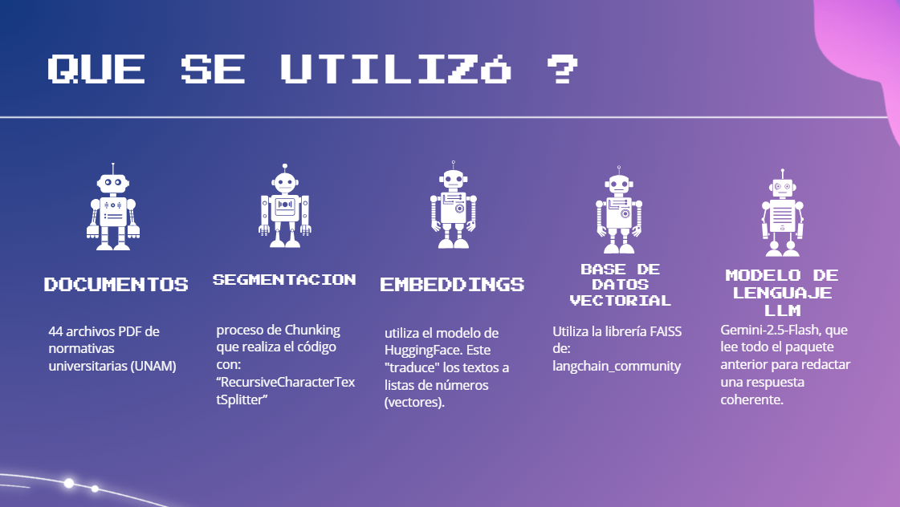
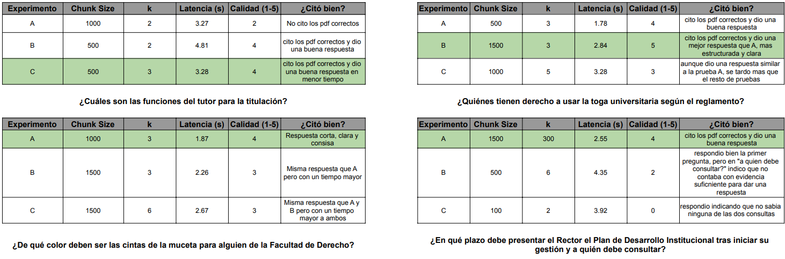
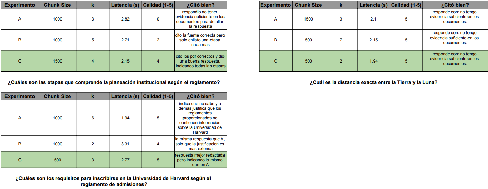

PROYECTO RAG

(CODIGO PRINCIPAL: chat.py - Correr con: streamlit run chat.py en (venv))

El presente proyecto consiste en el desarrollo de un sistema de Generación Aumentada por Recuperación (RAG, por sus siglas en inglés), diseñado específicamente para facilitar la consulta y comprensión de los 44 reglamentos que rigen nuestra institución. En un entorno donde la normativa legal es extensa y compleja, este asistente permite a los usuarios obtener respuestas precisas, inmediatas y fundamentadas en fuentes oficiales.

PRUEBAS

DECISION FINAL

Tras realizar las pruebas experimentales con diversas configuraciones de parámetros, se ha seleccionado la siguiente configuración como la óptima para el Asistente de Normativas Institucionales:

Tamaño de Chunk seleccionado: 1500
Valor de k seleccionado: 3 (o 4 para mayor profundidad)

JUSTIFICACION

Integridad del Contexto (Chunk 1500): Los reglamentos universitarios suelen tener artículos extensos o listas de funciones (como se vio en el Reglamento de Planeación). En las pruebas con Chunk 500, se observó que la respuesta a veces era incompleta o el modelo indicaba "no tener evidencia suficiente" debido a que la información quedaba fragmentada en diferentes pedazos de texto. Con 1500, el sistema logra captar artículos completos en un solo bloque, mejorando la coherencia de la respuesta y obteniendo calificaciones de calidad de 5/5 en preguntas complejas.																
Equilibrio de Latencia (k=3): Al observar las métricas de tiempo, un valor de k=3 mantiene la latencia en un promedio de 2.26s a 2.84s. Aunque subir el valor de k a 6 o 7 puede aportar más fragmentos, se notó que el tiempo de respuesta aumenta sin necesariamente mejorar la calidad de la respuesta final, ya que el modelo recibe demasiada información redundante.		

Precisión y Veracidad: Esta configuración demostró ser la más robusta para cumplir con las Reglas Importantes del proyecto:								

Muestra fuentes: En casi todas las pruebas con estos valores, el sistema citó correctamente los PDF (ej. Reglamento de la Toga o Planeación).						

Respuesta "no sé": El sistema mantuvo su capacidad de rechazar preguntas fuera de contexto (como la de la Universidad de Harvard), respondiendo correctamente que no contaba con evidencia suficiente.
